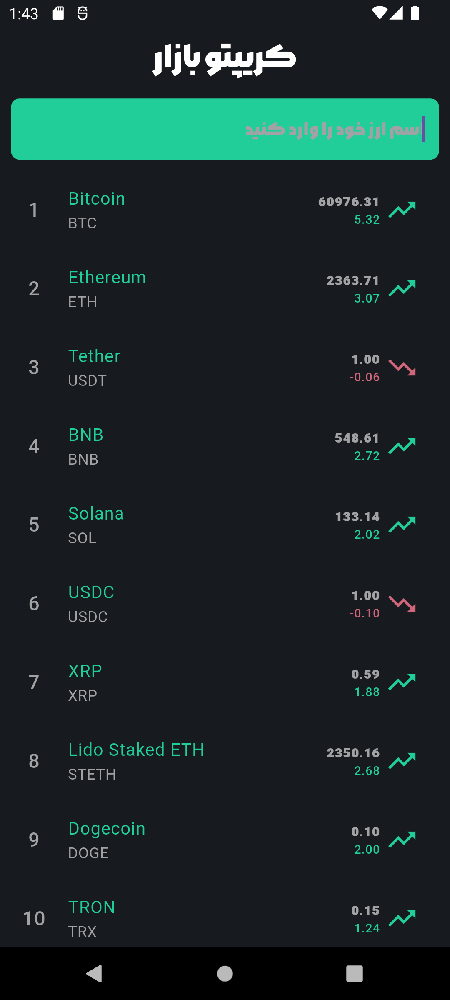

# Crypto

---

## 🚀 معرفی پروژه

Crypto یک اپلیکیشن مدرن برای مدیریت و مشاهده ارزهای دیجیتال است. 
این اپلیکیشن با طراحی جذاب و عملکرد سریع، تجربه‌ای حرفه‌ای و روان را برای کاربران فراهم می‌کند.

---

## 📸 اسکرین‌شات‌ها
    

---

## 🎥 ویدیو دمو

برای مشاهده‌ی عملکرد اپلیکیشن، [اینجا کلیک کنید](https://raw.githubusercontent.com/yasinowo/Crypto/refs/heads/main/Screenrecorder-2025-02-07-13-51-43-535.mp4).

---

## 🔥 ویژگی‌ها

✅ **طراحی مدرن** – بهره‌گیری از رابط کاربری جذاب و حرفه‌ای  
✅ **عملکرد سریع** – بهینه‌سازی شده برای تجربه‌ای روان و بدون لگ  
✅ **قابلیت نمایش لیست ارزهای دیجیتال** – مشاهده اطلاعات کامل ارزها در لحظه  
✅ **جستجوی سریع** – امکان یافتن ارزهای دیجیتال به‌سرعت  
✅ **نصب آسان** – تنها با یک کلیک برنامه را دریافت و اجرا کنید  

---

## 📥 نصب و اجرا

1. **دانلود آخرین نسخه**  
   آخرین نسخه‌ی اپلیکیشن را از [اینجا دانلود کنید](https://raw.githubusercontent.com/yasinowo/Crypto/refs/heads/main/cryptolist.apk).

2. **نصب فایل APK**  
   - روی لینک دانلود کلیک کنید و فایل APK را دریافت کنید.  
   - فایل را اجرا کرده و نصب را تکمیل کنید.  
   - اپلیکیشن را باز کنید و از امکانات آن لذت ببرید!  

---

## 📞 تماس با من

به کمک نیاز دارید یا سوالی دارید؟ من اینجا هستم تا به شما کمک کنم:

- **تلگرام**: [yasin](https://t.me/yasinid)

---
